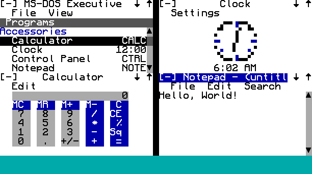

# cc-binaries

ComputerCraft programs, consolidated from separate repositories via `git subtree` (each subfolder keeps its original commit history).

## ArcadeOS

[`arcadeos/`](./arcadeos) is a Windows 1.0–style shell that runs everything below as apps, with tiled windows, menu bars, an icon strip and Windows 1.0 accessories. To install it on an Advanced Computer:

```
wget run https://raw.githubusercontent.com/Arcadesys/cc-binaries/main/arcadeos/install.lua
```



See the [ArcadeOS README](./arcadeos/README.md) for usage and for writing apps.

## Arcade cabinets

For a computer that runs a single game, install just that game and the files it needs. `--startup` makes the computer boot straight into it:

```
wget run https://raw.githubusercontent.com/Arcadesys/cc-binaries/main/cc-arcade/get.lua pineslots --startup
```

| Program | Game |
| --- | --- |
| `pineslots` | [Pine Slots](./cc-arcade/pineslots/README.md): slot machine with a physical pull arm and three buttons |
| `pinejack` | [Pine Jack](./cc-arcade/pinejack/README.md): blackjack |
| `pinebox` | [Pine Shut the Box](./cc-arcade/pinebox/README.md): High Rollers–style grand prize round with thrown dice |
| `race` | Pine3D Derby: race display, betting station or exhibition |
| `pineball` | [Pine Ball](./computercraft_scripts/pine-ball/README.md): baseball |
| `pinelinks` | [Pine Links](./computercraft_scripts/pine-links/README.md): mini golf |
| `pinelanes` | [Pine Lanes](./computercraft_scripts/pine-lanes/README.md): bowling |
| `pinedungeon` | [Pine Dungeon](./computercraft_scripts/pine-dungeon/README.md): dungeon crawler |
| `pineface` | [Pine Face](./computercraft_scripts/pine-face/README.md): Faceball-style Smiley tag for up to four networked players, bots filling empty seats |
| `wordle` | [Daily Wordle](./cc-arcade/wordle/README.md): the server's Minecraft word of the day in six guesses |

To put every Pine game on one computer and choose between them, install `all`:

```
wget run https://raw.githubusercontent.com/Arcadesys/cc-binaries/main/cc-arcade/get.lua all --startup
```

That boots into [Pine Arcade](./cc-arcade/pinearcade/README.md), a Pine3D carousel of the installed games (about 665 KiB in all; the games share one copy of Pine3D). Pick a game to play it, or to make it what the computer starts into; the STARTUP tile switches back to the menu or turns autostart off.

Run it with no program name to choose from a menu. Every install also includes `house`, which joins the computer to the house bank (`house setup station <modem> <host-id>`), and `config`, which teaches the three cabinet buttons. Games run on a practice meter until the computer is a house station.

- `get update`, run in `/arcade`, re-downloads everything for that cabinet from the same source.
- `get boot <program|off>` changes what the computer starts into (the same thing the Pine Arcade menu does).
- `get list` shows the programs.
- `--monitor NAME` picks the screen.
- `--base https://raw.githubusercontent.com/<owner>/cc-binaries/<branch>` installs from a fork or branch.

The download list is [`cc-arcade/manifest.json`](./cc-arcade/manifest.json). It is generated by following each game's `require` calls (`python3 cc-arcade/tools/manifest.py`, also run by `derby/tools/bundle.py`), so regenerate it after adding a module.

## Testing Pine arcade contracts without Minecraft

Run `python3 cc-arcade/tools/test_contracts.py` with Python 3 and Lua 5.3/5.4
(or an existing LuaTeX installation). The [contract harness](./cc-arcade/tests/README.md)
boots the real house/client modules on isolated fake computers, faults Rednet
messages, checks wallet consumers, and documents the remaining in-game release gate.
The [payout analysis](./cc-arcade/tests/payout-analysis.md) contains proposed,
not-yet-applied single-player tables and the four requested play-mode boundaries.

## TurtleOS: early-game turtle jobs

[`cc-turtleos/`](./cc-turtleos) is a menu of turtle jobs. Install it on a turtle:

```
wget run https://raw.githubusercontent.com/Arcadesys/cc-binaries/main/cc-turtleos/install.lua
```

Pick a role, then a job. Each job has a **How to set up** page, options you can change with the arrow keys, a fuel estimate, and **Start on boot**, which keeps it working after a chunk reload. Press Q while it runs to send it home.

| Job | What it does |
| --- | --- |
| Farmer › Crop farm | Harvests ripe wheat, carrots, potatoes and beetroot, replants, and fills empty farmland |
| Farmer › Sugar cane farm | Cuts cane (or cactus) down to the bottom block so it regrows |
| Farmer › Tree farm | Chops and replants a 4x4 grid of trees |
| Miner › Branch miner | Main tunnel with side branches, follows ore veins, tosses stone, places torches, unloads at a chest when full, and resumes after a reboot |

Every job drops its output in a chest behind the turtle's start spot and takes fuel from the turtle's inventory or a chest under that spot. Writing a new job: see [`cc-turtleos/agents.md`](./cc-turtleos/agents.md).

## Testing turtle scripts without Minecraft

[`turtlesim/`](./turtlesim/README.md) runs any turtle script against a simulated turtle and world in CraftOS-PC, with a report of fuel, ores and failed actions:

```
turtlesim/turtle path/to/script.lua
turtlesim/turtle mine --seeds 1-8 --length 64   # cc-factory branch miner across 8 ore layouts
turtlesim/turtle harness                        # all cc-factory harnesses, headless
```

## Programs

| Folder | Source repo |
| --- | --- |
| [`cc-turtleos`](./cc-turtleos) | [Arcadesys/cc-turtleos](https://github.com/Arcadesys/cc-turtleos) |
| [`cc-arcade`](./cc-arcade) | [Arcadesys/cc-arcade](https://github.com/Arcadesys/cc-arcade) |
| [`cc-factory`](./cc-factory) | [Arcadesys/cc-factory](https://github.com/Arcadesys/cc-factory) |
| [`cc-screensaver`](./cc-screensaver) | [Arcadesys/cc-screensaver](https://github.com/Arcadesys/cc-screensaver) |
| [`cc-jukebox`](./cc-jukebox) | [Arcadesys/cc-jukebox](https://github.com/Arcadesys/cc-jukebox) |
| [`computercraft_scripts`](./computercraft_scripts) | [Arcadesys/computercraft_scripts](https://github.com/Arcadesys/computercraft_scripts) |

For turtle branch mining, start with the [safe mining pilot guide](./cc-factory/SAFE_MINING.md). It covers bounded jobs, checked return/unload, restart recovery, installation, and the supervised in-world checks required before scaling.

Playing ATM10 from an underground starter base? Follow the [first private mining turtle checklist](./cc-factory/ATM10_FIRST_TURTLE.md), using the cc-factory installer and its down-output/up-supply bay. This is a different implementation from the cc-turtleos miner above; keep the first run supervised.

The [mining fleet guide](./cc-factory/FLEET_MINING.md) adds automatic assignment of pre-approved jobs, durable area reservations, and shared-world turtle-tester scenarios. A lost turtle's area remains quarantined until manually reconciled.

## Pine3D Derby and diamond house

The [derby prototype](./cc-arcade/derby/README.md) adds a shared 3D horse race, separate betting stations, and a central diamond-backed arcade wallet. It includes the [venue concept](./cc-arcade/derby/docs/diamond-house-concept.png); live Minecraft acceptance remains pending.

## Pine games

The standalone Pine3D games are in [`computercraft_scripts`](./computercraft_scripts). Copy an entire game folder to a CC:Tweaked computer so its bundled libraries stay beside the launcher.

| Game | Launcher after copying its folder | Details |
| --- | --- | --- |
| [Pine Ball](./computercraft_scripts/pine-ball/README.md) | `/pine-ball/ball.lua` | Furball baseball vs CPU or a 2-player duel |
| [Pine Links](./computercraft_scripts/pine-links/README.md) | `/pine-links/golf.lua` | Furball's Marovitz-inspired Hole 3, par 3 |
| [Pine Lanes](./computercraft_scripts/pine-lanes/README.md) | `/pine-lanes/bowl.lua` | Furball ten-frame bowling for 1–4 players |
| [Pine Dungeon](./computercraft_scripts/pine-dungeon/README.md) | `/pine-dungeon/dungeon.lua` | First-person crawler with an ASCII map |
| [Pine Face](./computercraft_scripts/pine-face/README.md) | `/pine-face/face.lua` | Faceball 2000–style maze tag: four Smileys over rednet, bots in empty seats |

Pine Ball, Pine Links and Pine Lanes run Lua ports of the [furball-simulator](https://github.com/Arcadesys/furball-simulator) sport engines, checked against fixtures generated from the TypeScript. After tuning furball, run `computercraft_scripts/tools/furball-fixtures/update.sh` and then each game's `tools/test_craftos.sh`.

Note: [Arcadesys/computercraft](https://github.com/Arcadesys/computercraft) was skipped — it's an empty repository on GitHub (no commits).
