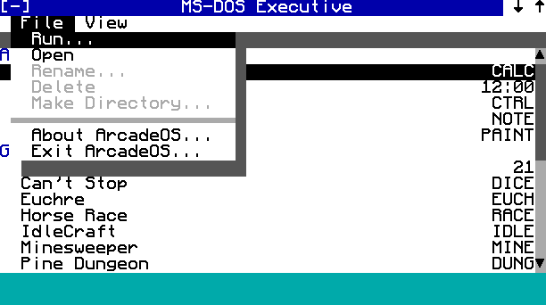
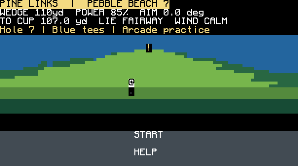
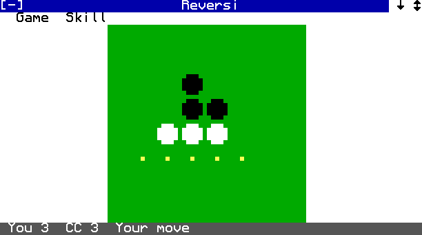
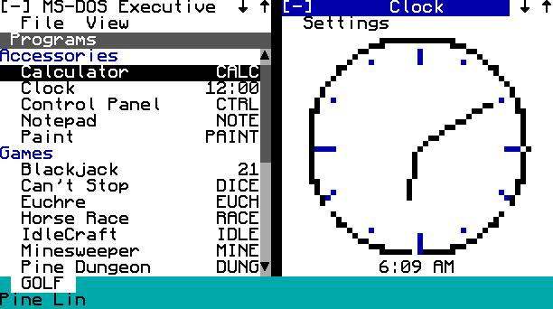

# ArcadeOS 1.00

A Windows 1.0–style shell for [CC: Tweaked](https://tweaked.cc) that runs every program in this repo as an app: arcade and card games, the Pine3D games, media players, turtle tools, and a set of Windows 1.0 accessories.


Like Windows 1.0, windows **tile** and never overlap. Each window has its own menu bar, you can **Zoom** one to fill the screen, and iconized programs sit in a strip along the bottom. The MS-DOS Executive is home base.

| | |
|---|---|
|  |  |
|  |  |

## Install

On an **Advanced Computer** with the HTTP API enabled:

```
wget run https://raw.githubusercontent.com/Arcadesys/cc-binaries/main/arcadeos/install.lua
```

Setup lists the packages with their sizes and preselects whatever fits on the disk; a stock computer has about 1 MB.

| Package | Size | Contents |
|---|---|---|
| core | ~116K | ArcadeOS and the accessories (always installed) |
| arcade | ~152K | Blackjack, Slots, Can't Stop, Horse Race, RPS Rogue, IdleCraft |
| factory | ~95K | Minesweeper, Solitaire, Euchre, Schema Designer |
| pine | ~518K | Pine Ball, Pine Links, Pine Lanes, Pine Dungeon |
| media | ~45K | Jukebox, MIDI Player, screen savers |
| turtle | ~392K | Factory and TurtleOS (preselected only on turtles) |

Setup writes `/startup.lua` so ArcadeOS starts at boot. If you already had one, it's kept as `/startup.lua.bak`.

Setup options:
- `--yes`: install the default selection without asking.
- `--base <raw url>`: install from a fork or branch.
- `--local <dir>`: install from a copy on disk.
- `--no-startup`: don't change the boot program.

## Using it

- **Launch programs** from the MS-DOS Executive: double-click an entry, or select it and press Enter. View → Files switches to a file manager. Opening a `.txt` file starts Notepad, `.nfp` starts Paint, and `.lua` runs the program in a window.
- **Tiling:** up to four windows share the screen. Opening a fifth iconizes the one you used least recently.
- **Title bar:**
  - `[-]` opens the system menu (Restore, Iconize, Zoom, Close).
  - `↓` iconizes the window.
  - `↑` zooms it to fill the screen.
- **Icons** along the bottom are iconized programs; click one to bring it back. An iconized Clock shows the time.
- **Games run fullscreen.** Press **Ctrl+Tab** to switch away from one; it keeps running as an icon.

| Keys | Action |
|---|---|
| Ctrl+Tab | Switch to the next window (the way out of fullscreen games) |
| Ctrl+M | Open the focused window's menus; use the arrows, Enter, and Backspace to cancel |
| Ctrl+W | Close the focused window |
| Ctrl+T (hold) | Terminate the focused program |

- **Control Panel** sets:
  - the desktop color;
  - the screen saver and how long to wait before it starts;
  - free play or credits for the arcade games;
  - a 12- or 24-hour clock.
- **Exiting:** closing the MS-DOS Executive, or choosing File → Exit ArcadeOS, returns you to CraftOS.

Arcade games normally need credit floppy disks. Under ArcadeOS they run on **free play** by default; set Arcade to "Credits" in Control Panel to use real disks. Run standalone, as before, the games behave exactly as they always did.

## Apps

| Group | Apps |
|---|---|
| Accessories | Notepad, Clock, Calculator, Paint, Control Panel |
| Games | Reversi, Blackjack, Slots, Can't Stop, Horse Race, RPS Rogue, IdleCraft, Minesweeper, Solitaire, Euchre, Pine Ball, Pine Links, Pine Lanes, Pine Dungeon |
| Media | Jukebox (needs a speaker), MIDI Player (reads `/midi/*.mid`) |
| Turtle | Schema Designer, Factory and TurtleOS Roles (these two appear only on turtles) |
| System | MS-DOS Executive, Terminal |

cc-arcade's kiosk programs are left out because ArcadeOS replaces them or because they need kiosk hardware: `menu`, `kiosk`, `cashier`, `exchange`, `setup`, `dedicate`, `config`.

The original programs have small patches so they run under ArcadeOS: free play, returning to the desktop instead of relaunching the arcade menu, and finding their own files wherever they're installed. Every patch is guarded, so the programs behave the same when run standalone. cc-arcade's generated `install.lua` bundle predates these patches; rebuild it with `bundle.ps1` if you still use it.

## Writing an app

Each app is a folder in `apps/` with an `app.lua` manifest and usually a `main.lua`:

```lua
-- apps/hello/app.lua
return {
    name = "Hello",
    group = "Accessories",   -- Accessories | Games | Media | Turtle | System
    icon = "HI",             -- up to 7 characters, shown when iconized
    native = true,           -- uses the arcadeos API; may prompt on Close instead of being killed
}
```

```lua
-- apps/hello/main.lua
local ui = arcadeos.lib("ui")
local dialog = arcadeos.lib("dialog")
arcadeos.setMenus({
    { label = "File", items = { { id = "about", label = "About..." }, "-", { id = "exit", label = "Exit" } } },
})
while true do
    local w, h = term.getSize()
    ui.fill(1, 1, w, h, colors.white)
    ui.center(math.ceil(h / 2), "Hello, ArcadeOS!", colors.black, colors.white)
    local ev, id = os.pullEvent()
    if ev == "arcadeos_menu" and id == "about" then dialog.alert("Hello", "A tiny app.")
    elseif ev == "arcadeos_menu" and id == "exit" then return end
end
```

**Manifest fields:**

| Field | Meaning |
|---|---|
| `entry` | Program to run. Relative to the app folder (default `main.lua`) or absolute. |
| `args` | Extra arguments passed to `entry`. |
| `display` | `"tile"` (default), `"zoom"` (always zoomed, keeps its title and menu bars) or `"full"` (whole screen, no chrome). |
| `min = {w, h}` | Minimum size. Apps that can't fit in a tile are promoted to zoom or full. |
| `requires` | Any of `color`, `speaker`, `http`, `turtle`. Turtle-only apps are hidden on computers; for the others, a message box explains what's missing. |
| `needs` | A file that must exist for the app to be listed, such as a library from an optional package. |
| `opens` | File extensions this app opens from the Executive, e.g. `{ "txt" }`. |
| `hold` | Keep the window open after the program exits, for command-line tools. |
| `hidden` | Leave the app out of the Programs list. |

**The `arcadeos` API** (a global, like `multishell`):
- **Window:** `setTitle(s)`, `setIcon(s)`, `setMenus(menus)`, `isIconic()`. Menu choices arrive as an `arcadeos_menu` event carrying the item id; resizes arrive as `term_resize`.
- **Launching:** `launch(appId, ...)`, `run(path, ...)`, `open(path)`, `apps()`.
- **Libraries:** `lib(name)` loads a shared library from `lib/`.
  - `ui`: fill/text, list box, text field, scroll bar, buttons.
  - `dialog`: `alert`, `confirm`, `yesNoCancel`, `prompt`, `openFile`, `saveFile`. Dialogs restore the window underneath when they close.
  - `canvas`: a 2×3-subpixel drawing surface.
- **Settings:** `getSetting(key, default)`, `setSetting(key, value)`, stored as `arcadeos.<key>`. `freeplay()` reports the arcade free-play setting.
- **Clipboard:** `getClipboard()`, `setClipboard(s)`.
- **System:** `getVersion()`, `exit()`, `theme()`, `screensavers()`, `previewScreensaver(name)`.

Programs that ignore the API also work. They get a real `shell`, a `multishell`-compatible API (so `bg`/`fg` in the Terminal open new windows), and window-local mouse coordinates. A call to `os.reboot()` or `os.shutdown()` closes only that program.

## How it works

- `boot.lua` shows the splash screen and starts `sys/kernel.lua`.
- **Processes:** every program runs in its own coroutine with its own `window`, through `/rom/programs/shell.lua` and `sys/host.lua`, in the same way `shell.openTab` works.
- **Event routing:**
  - Keyboard and mouse events go only to the focused window, with mouse coordinates made window-local.
  - All other events, such as timers, redstone and disks, go to every program.
- **Tiling:** `sys/wm.lua` computes the layout.
- **Drawing:** `sys/chrome.lua` draws the title bars, menus, icons and message boxes. The EGA palette in `sys/theme.lua` is re-applied whenever a fullscreen game that changed the palette loses focus.
- **Small screens:** narrower than 51 or shorter than 19 characters (turtles, pocket computers), the window manager shows one window at a time.

The original programs stay in their own folders. `layout.json` maps them onto the computer (for example `cc-arcade/` → `/pkg/arcade/`) and groups them into packages.

## Developing

Everything runs in [CraftOS-PC](https://www.craftos-pc.cc). `tools/dev.py` mounts the repo folders the way `layout.json` maps them:

```bash
python3 arcadeos/tools/dev.py test
```

```bash
python3 arcadeos/tools/dev.py run
```

```bash
python3 arcadeos/tools/dev.py screens /tmp/arcadeos-shots
```

- `test`: headless unit tests, kernel routing tests, and a smoke test that launches every app.
- `run`: opens CraftOS-PC booted into ArcadeOS.
- `screens`: renders the screenshot scenarios in `tests/screens.lua` to PNG, using CraftOS-PC's font.

After adding or moving files, regenerate the installer's file list and verify it end to end:

```bash
python3 arcadeos/tools/dev.py files
```

```bash
python3 arcadeos/tools/dev.py install-test
```
