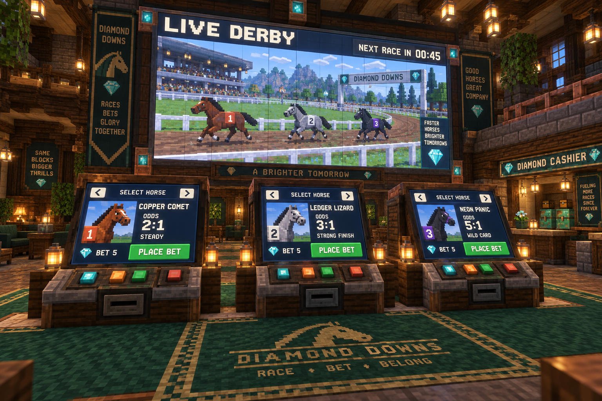

# Pine3D Derby and the diamond house

A working prototype of a shared horse race, separate betting terminals, and a
central diamond-backed arcade wallet. The existing `race.lua` / Horse Race
launch path is retained. Live Minecraft installation and physical diamond
transfers remain an acceptance gate; new hosts start paused.

## Imagine the room



The venue has a constantly running race on an overhead monitor wall and **three
betting stations** beneath it. Each station can select any horse, showing its
name, odds, portrait and racing personality. A side cashier exchanges diamonds
and credits. The image is a visual concept: its portraits, fractional odds,
extra signage and monitor graphics illustrate the room rather than the current
ComputerCraft interface. Horse portraits are a future interface addition.

The prototype preserves **COPPER COMET** (steady), **LEDGER LIZARD** (closer), and
**NEON PANIC** (chaotic). Its generated oval includes rails, starting gates,
finish gantry, infield, grandstand and a scenery tote board. The live interface
uses numbered saddlecloths, text labels and large controls. Camera choices are
follow, fixed overview and finish line.

## Try the exhibition

Install the ArcadeOS arcade package, or copy the `cc-arcade` runtime folder with
its complete `derby` subfolder. In ArcadeOS, open a terminal and change to
`/pkg/arcade`; for a standalone copy, change to its installation directory.

```lua
race --demo
```

Use **1 / 2 / 3** to choose follow / overview / finish, **C** to cycle cameras,
and **Q** to exit. The camera preference is saved. The colour display must be at
least 39 × 19 characters. The exhibition has no redeemable funds.

## Set up a house

Use house-owned advanced computers and colour monitors, a private wired modem
network, disk drives at player stations and the cashier, and three separate
cashier inventories: intake, bank and output. Bearer cards identify accounts;
they do not authenticate Minecraft players. This is scoped to a private friends'
server, not a hostile public network.

Run setup on each computer from its installed arcade directory:

| Computer | Setup | Run |
| --- | --- | --- |
| House host | `house setup host <wired-modem>` | `house host` |
| Overhead display | `house setup display <wired-modem> <host-id>` | `house display` |
| Each of three betting stations | `house setup station <wired-modem> <host-id>` | `house station` or `race` |
| Cashier | `house setup cashier <wired-modem> <host-id>` | `house cashier` |

Host setup asks for the intake, bank and output peripheral names and the allowed
client computer IDs, grouped by role. Configuration is stored at
`/house-config.json`. The bank and client journals live at `/house-bank/state.*`
and `/house-client/state.*`; retain those files and the config when updating.
Reconfiguration requires backing up and removing the config explicitly.

The host alone owns balances, race state and item transfers. Its **F** command
recognises house diamonds placed into the bank; ordinary players deposit through
the cashier intake instead. Issue an account on an inserted disk using cashier
**N**. Fresh balances are zero. Old `credits.json` files remain intact but their
balances are neither imported nor redeemable. Exchange is diamonds only at
**1 diamond = 1 credit**. Obsidian, eye and pearl exchanges are retired.

Before unattended operation, verify one host, the display, concurrent wagers at
two or more stations, and a cashier deposit → winning race → withdrawal against
actual Minecraft inventory counts. Only then use host **P** to start/resume the
schedule. To launch after reboot, put `shell.run` for the configured role in the
computer's startup file, using the installed absolute `house.lua` path.

## Betting and recovery

The schedule opens betting for 60 seconds, locks for 5 seconds, runs the race,
then shows results for 15 seconds. Races use seeded fixed simulation steps;
rendering and terminal width cannot change the result. The host persists the
locked seed and accepted tickets. On restart it reconstructs the same simulation
from the saved seed and tick.

Each account can confirm one ticket per race for 5, 10 or 20 credits. The station
shows the exact **total return including stake** before final confirmation.
Calibration ran 100,000 seeds and targets a 10% house margin before whole-credit
rounding. `odds.json` records the sample counts and version; `odds.lua` is the
bundled runtime table. Observed wins were 38,045 / 26,209 / 35,746; mean winning
finish time was 42.33 seconds. Final payouts include the stake:

| Horse | Stake 5 | Stake 10 | Stake 20 |
| --- | ---: | ---: | ---: |
| COPPER COMET | 11 | 23 | 47 |
| LEDGER LIZARD | 17 | 34 | 68 |
| NEON PANIC | 12 | 25 | 50 |

Wagers reserve enough house diamonds for their maximum return. Slots, Blackjack,
RPS Rogue and Track use acknowledged reservations and settlements through the
same wallet. RPS reserves the next floor's reward before continuing. Removing a
card after a wager does not redirect winnings.

Network timeouts retain the request ID for **R** retry at a station or cashier.
An interrupted arcade round is shown on the host; review it and use **U** to
refund by round ID. A cashier transfer writes its intent before moving items and
credits only the returned transfer count. An uncertain result pauses financial
actions. Inspect intake, bank and output before using host **R** to reconcile the
transaction ID and actual moved count. Retries never repeat an uncertain physical
transfer. Keep the bank inaccessible to players and other automation while it
backs balances.

## Reproduce checks and packaging

These commands use a fresh isolated CraftOS-PC data directory. The default
executable is `/Applications/CraftOS-PC.app/Contents/MacOS/craftos`.

```sh
python3 cc-arcade/derby/tools/run.py
python3 cc-arcade/derby/tools/run.py derby.tests.games
python3 cc-arcade/derby/tools/run.py derby.tests.rendered
python3 arcadeos/tools/dev.py test apps smoke
python3 arcadeos/tools/dev.py install-test
```

The rendered suite writes terminal dumps suitable for `arcadeos/tools/render.py`.
The game suite exercises actual source paths with input/pacing stubs. Inventory
acceptance in the core suite uses simulated peripherals, not real Minecraft
chests. See [verification and remaining gates](docs/verification.md).

```sh
python3 cc-arcade/derby/tools/bundle.py
python3 arcadeos/tools/dev.py files
```

Those commands rebuild the standalone `cc-arcade/install.lua` and the ArcadeOS
manifest. Tests, tools, docs and the concept image are excluded from runtime
packages. Pine3D is bundled at the revision in `vendor/REVISION.txt` with its MIT
license; no runtime library download is required.
