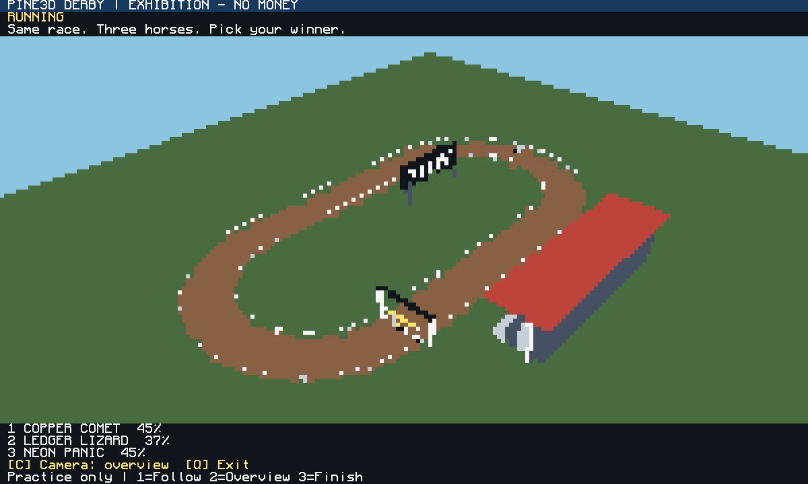
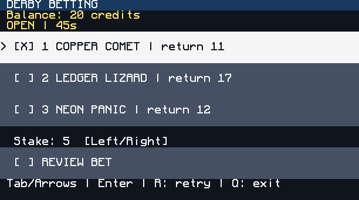

# Verification and remaining acceptance gates

Checked on 2026-10-01 from the isolated `codex/pine3d-derby-house` branch.
The venue illustration is concept art; the images below are actual terminal
output produced by the current Lua renderer and betting-station event loop.

## Current checks

| Check | Result |
| --- | --- |
| `tools/run.py` core suite | 1,159 assertions passed |
| `tools/run.py derby.tests.games` | 37 actual game-path assertions passed |
| `tools/run.py derby.tests.rendered` | Race, betting, confirmation and input scenarios passed at 51×19 and 100×40 |
| `arcadeos/tools/dev.py test apps smoke` | All 28 checks passed |
| `arcadeos/tools/dev.py install-test` | Fresh ArcadeOS install passed; manifests and apps load |
| `git diff --check` | Passed |

Core tests include a simulated deposit → winning wager → withdrawal, concurrent
spend rejection, frozen late betting, retries after betting locks, captured
account settlement, partial/full-output transfers, disconnected peripherals,
restart and reconciliation after items move but receipt persistence fails,
round refunds, and recovery from an interrupted state write. The game suite
runs the real Slots, Blackjack, Track and RPS money paths while stubbing input,
presentation and pacing.

The rendered suite exercises keyboard focus, ticket review, card removal before
confirmation, touch selection and confirmation, three camera views, and full
race finish. Visual inspection confirms high-contrast text, numbered horses and
explicit control labels. Render throughput measured 287.7 FPS at 51×19 and
190.3 FPS at 100×40 (p95 frame time 5 ms / 7 ms) in this headless CraftOS-PC run.
Those numbers measure renderer throughput, not monitor/network performance in
Minecraft. An earlier isolated GUI exhibition was visibly inspected in this
chat; the current branch's reproducible evidence is the suites above.

The fixed payout table comes from the simulation's 100,000-seed calibration.
It records 38,045 / 26,209 / 35,746 wins and a 42.33-second mean winning finish.
The headless calibration tool can reproduce it; it writes `odds.json` to its
isolated results folder instead of silently changing runtime rules.

## Required before live unattended use

- Identify the actual world/server, computer IDs, monitor sizes and wired
  inventory peripherals. The previously recorded local world path was absent
  when implementation was paused.
- Install one host, an overhead display, three betting stations and a cashier;
  register their exact IDs and inventory names. Keep the host paused initially.
- Verify concurrent accepted bets share a result; remove a player's card and
  reconnect a station before settlement, then confirm its balance at the host.
- Perform real Minecraft diamond deposit, wager, winnings and withdrawal;
  reconcile physical bank diamonds against outstanding balances and reserves.
- Measure rendered performance and legibility on the actual monitor wall.

Public-server authentication, physical building construction, player-terminal
horse portraits and the concept image's richer graphics remain future work.
The current whole-arcade wallet migration is a substantial behaviour change:
legacy balances are preserved as files but are not redeemable. Do not mix older
cashier/game clients with this bank.
